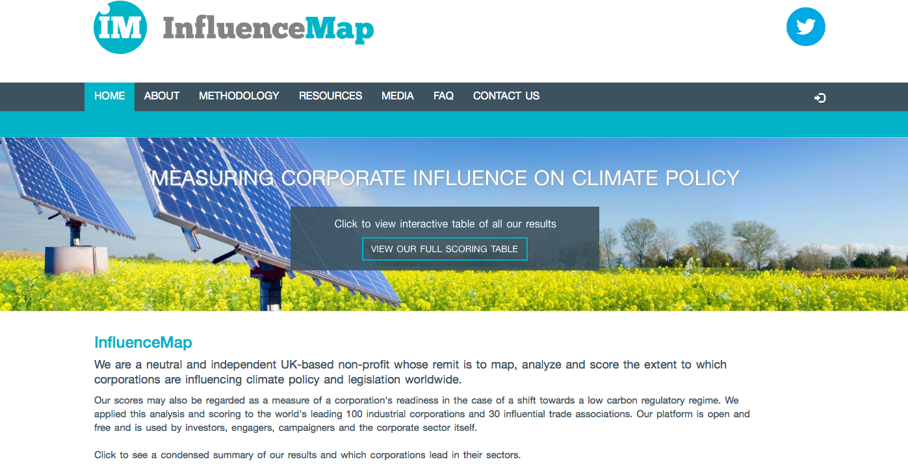

# Influence Map



Influence Map measures and lists corporate influence on climate policy worldwide. The project was created to provide a ranking system that is, in their own words, “as objective as possible”, as a tool to address gap in how corporations influence climate legislation.

The project outputs to date have been a list of rankings of corporations released in 2015. This report created a good deal of traction in the media, with almost 30 citations of the report in the press. The project also reports engagement from stakeholders such as investor groups and policymakers:

“We had opinions from some very, very influential, some senior climate policy legislators who said that our, for example, our report on oil and gas industry lobbying was very timely and very helpful in balancing similar propaganda coming from the oil and gas industry.” Dylan Tanner, Founder and VP.

To generate the score for each corporation, Influence Map aggregates information from 8 different publicly available data sources, querying these sources with 12 questions relating to climate policy. To constitute the score, the Influence Map’s team uses a traditional method encountered in other Influence Mapping projects, relationship mapping, to weight the data, which was then processed by the team’s algorithm to generate a numerical score to feed into the Influence Map rankings. (More detailed information on the project’s methodology).

The project’s aim to be “as objective as possible”, and their quantified-approach, provides more leverage to stakeholders, who might have had to deal with atomised sources of data about climate policy and corporate influence in the past. 

The impact of the project has been amplified by their project management strategy, which involved from its early stages engagement with a core user group of specialists in the sector who have used the tool and organically disseminated their findings. This is combined with a strong and strategic media engagement strategy, timing important reports to coincide with important events or reports in the same sector and formatting them in an easily accessible manner to bring the most newsworthy information to the top line. 

The team of 10 combines expertise from a variety of different disciplines, including design, software development, physics and analysis, aiming now to bring in visualisation expertise to increase legibility of the outputs. In terms of sustainability of the project, the aim is to increase the project’s links to specialist media. However, plans for the future of Influence Map will be affected by the financial resources available to the project.
