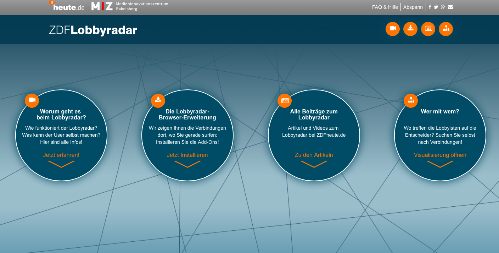

# Lobbyradar



Lobbyradar uncovers the lobbying groups and private interests in German politics, by enabling users to explore network visualisations that show links between institutions and people of influence within the german political sphere. There is also a browser plugin, which, once installed, supplies information about politicians and lobbyists via a tooltip when their name appears on a website.

The project started as a cooperation between ZDF (Zweites Deutsches Fernsehen) and the Medieninnovationszentrum Babelsberg (MIZ) with the aim to tackle lobbying and its intersection within the political sphere in Germany. The project took shape during a scholarship of the three journalists Michael Hartlep, Dominik Wurnig and Jan Schneider at MIZ and included a series of brainstorming workshops organized between journalists, coders and designers. 
 
Lobbyradar’s team was spread across multiple cities in Germany and mainly composed of the three journalists, working on the project part-time over six months alongside programmers from Open Data City. These disparate locations were challenging for the team, and coordination was mainly through Skype and other tools for remote communication.
 
The project used open source components “such as Angular, d3, Leaflet, Mongo DB and countless npm modules and built our own open source software around it”. The project used mostly bespoke scripts based on node.js for web scraping to gather data from public sources. However, in some instances manual scraping and manual data cleaning was necessary. 

Usability was an important factor for the project’s team, and was considered to be crucial for improving the impact of the work. After building the website and the plugin, Lobbyradar organized user-centered workshops to get feedback from potential users in order to improve and iterate their website. It was this drive for usability that drove the team to develop the browser plugin, currently available for Firefox, Chrome and Safari, in an effort to increase awareness for the system and its content. The Lobbyradar website has had 500 000 unique visits. However, no statistics about the number of plugin users exist so far.
 
Lobbyradar’s data has been updated regularly and contains more than 60 000 data points. However, as of December 2015 the http://lobbyradar.de has closed down pending a new partner to be legally responsible for the site’s content. The current data will be hosted on a mirror site, http://lobbyradar.org. Wurnig and Schneider are now looking for potential new funders to make the project evolve, continue and grow, aiming to have the site back online in January 2016.
