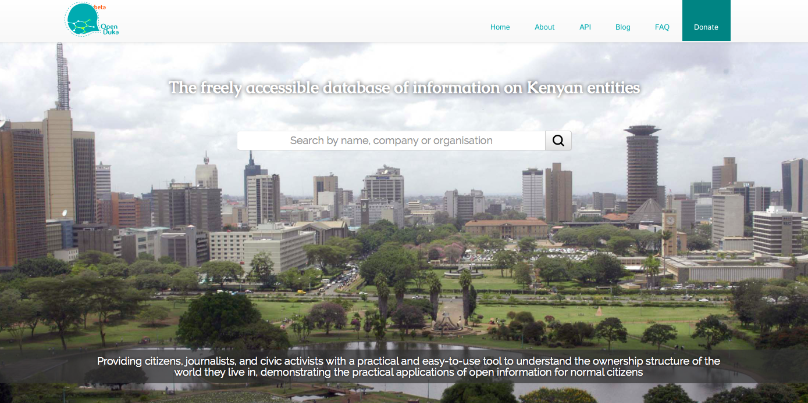

# Open Duka



Open Duka was started to gather information in one repository to create a searchable database of institutions and actors in power and commerce in Kenya, in order to foster more accountability and to facilitate oversight by citizens, journalists and civic activists. 

Incubated by the Open Institute, the project is open source and the database is freely available and can be queried via the Open Duka API. Data has been scraped from online sources that provide shareholder information, procurement information, legal cases and company information, from data providers and partners The Kenyan Gazette and Kenya Law. Open Duka’s site is coded in PHP and the database is managed with MyTML library. Visualisation is now based on D3 javascript library.

The project has faced challenges since its inception, most notably access to data and tools. For example, the lack of a proper API to the Kenya Law data has slowed down access to their content. The problem with access to data has been exacerbated by lack of funds for tools to convert between different data formats. On occasion, Open Duka has found it necessary to translate data that was not machine readable with the tools available and to enter data manually into the database. 

Alongside technological challenges in managing the database and visualisation tools, the team came across specific challenges when they attempted to use Document Cloud to extract information from documents: “Document Cloud couldn't pick up the entities, for example, the African names, can't pick, or it doesn't know how to identify a person and an institution based on our locality,” says Charagu.

At this stage, the impact of the project has been not been formally assessed, and the online outreach is fairly small. 

Benjamin Charagu and his team at the Open Institute are looking to change the model of Open Duka in order to potentially improve its impact by offering the database to organisations which might need entities mapping. However, these plans hang in the balance as the project’s funding situation is critical, making the future of Open Duka uncertain. 

